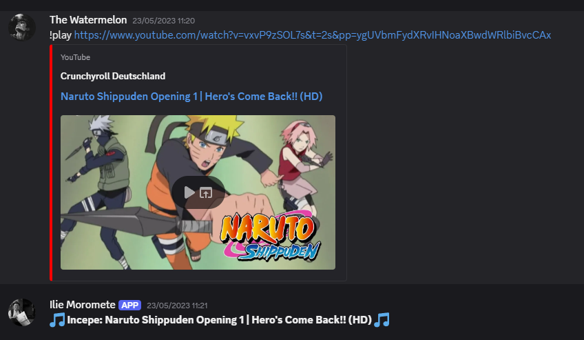
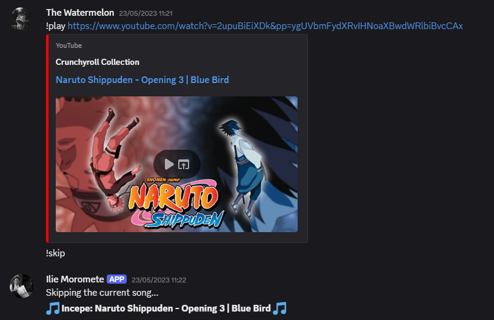
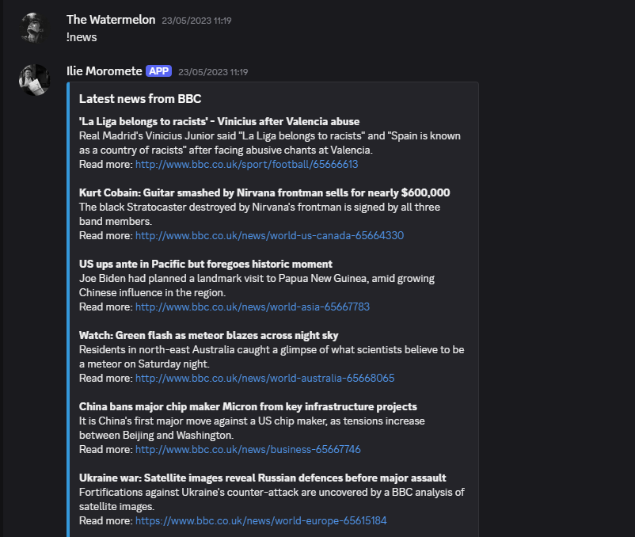
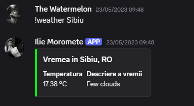

# 🤖 Ilie Moromete – Discord Bot

A multifunctional Discord bot built with `discord.py`, offering fun commands, news updates, music playback from YouTube, and real-time weather information. Designed for Romanian-language communities but easily extendable for any server.

---

## 🚀 Features

- 👋 Greets new members and gives them a role automatically
- 📰 Fetches the latest news from BBC using NewsAPI
- 🎵 Plays music from YouTube using `yt-dlp` and FFmpeg
- 🌦️ Displays real-time weather using OpenWeatherMap API
- 🎲 Fun commands like `!roll`, `!ping`, `!echo`
- 📦 Queue system for music with skip and leave commands

---

## 🛠 Technologies & Libraries

- [`discord.py`](https://github.com/Rapptz/discord.py) – Bot framework
- [`yt-dlp`](https://github.com/yt-dlp/yt-dlp) – YouTube download
- [`NewsAPI`](https://newsapi.org/)
- [`OpenWeatherMap`](https://openweathermap.org/)
- `asyncio`, `requests`, `python-dotenv`

---

## 🔐 Environment Variables

All sensitive keys and tokens are stored in a `.env` file (ignored via `.gitignore`):

```
DISCORD_TOKEN=your_discord_bot_token
WEATHER_API_KEY=your_openweathermap_api_key
NEWS_API_KEY=your_newsapi_key
```

Install `python-dotenv` if not already:

```bash
pip install python-dotenv
```

---

## ▶️ How to Run Locally

1. Clone the repository:
   ```bash
   git clone https://github.com/your-username/ilie-moromete-discord-bot.git
   cd ilie-moromete-discord-bot
   ```

2. Install the required libraries:
   ```bash
   pip install -r requirements.txt
   ```

3. Add your `.env` file to the root of the project.

4. Run the bot:
   ```bash
   python Bot_SECURE.py
   ```

---

## 📸 Screenshots

### 🎵 Music Playback with `!play`


### ⏭️ Skipping Songs with `!skip`


### 📰 News Command with `!news`


### 🌤️ Weather Info with `!weather`


---

## 📂 File Structure

```
├── Bot_SECURE.py           # Main bot script (token/API safe)
├── .env                    # Environment variables (not committed)
├── Pisica.gif              # Animated asset
├── song.mp3                # Sample audio file
├── ffmpeg/...              # FFmpeg directory (for playback)
├── Librarii utilizate.txt  # List of libraries used
```

---

## 👤 Author

Created by **Ciprian Belet**  
Feel free to contribute, open issues, or fork the project.

---

## 📜 License

This project is open-source and available under the MIT License.
